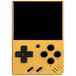

# Introduction
    

&nbsp;

This repository contains the SDL v2.0 source code, ported for the following handheld devices:  
- Miyoo Mini (Plus)  
  Utilizes SigmaStar MI GFX for rendering and is only tested on Onion v4.3.1-1.
- Motorola Photon Q (XT897)  
  Utilizes Wayland Client for rendering and is only supported on Sailfish OS v4.4.0.68.
- Motorola Droid 4 (XT894)  
  Utilizes Wayland Client for rendering and is only supported on Sailfish OS v4.6.0.15.

&nbsp;

All dependent libraries are stored in the "dependency" folder and need be built manually after building the SDL library.
```
SDL2_net-2.2.0.tar.gz
SDL2_ttf-2.20.2.tar.gz
SDL2_image-2.8.1.tar.gz
SDL2_mixer-2.6.3.tar.gz
```

&nbsp;

# How to Build the Source Code
## Miyoo Mini (Plus)
```
$ cd
$ wget https://github.com/steward-fu/website/releases/download/miyoo-mini/mini_toolchain-v1.0.tar.gz
$ tar xvf mini_toolchain-v1.0.tar.gz
$ sudo mini /opt

$ git clone https://github.com/steward-fu/sdl2
$ cd sdl2
$ make -f Makefile.mini cfg

$ make -f Makefile.mini gpu
$ ls swiftshader/build/lib*
    swiftshader/build/libEGL.so
    swiftshader/build/libGLESv2.so

$ make -f Makefile.mini sdl2
$ ls sdl2/build/.libs/libSDL2-2.0.so.0*
    sdl2/build/.libs/libSDL2-2.0.so.0
    sdl2/build/.libs/libSDL2-2.0.so.0.18.2
```

&nbsp;

## Miyoo A30
```
$ cd
$ wget https://github.com/steward-fu/website/releases/download/miyoo-a30/a30_toolchain-v1.0.tar.gz
$ tar xvf a30_toolchain-v1.0.tar.gz
$ sudo mv a30 /opt

$ git clone https://github.com/steward-fu/sdl2
$ cd sdl2
$ make -f Makefile.a30 cfg
$ make -f Makefile.a30 sdl2
```

&nbsp;

## Motorola Photon Q (XT897)
```
$ cd
$ git clone https://github.com/steward-fu/sdl2
$ cd sdl2/sdl2
$ ./autogen.sh
$ ./configure --enable-video-xt897 --disable-video-opengl --disable-video-opengles --disable-video-opengles2 --build=arm-linux
$ make -j4
$ sudo make install
```

&nbsp;

## Motorola Droid 4 (XT894)
```
$ cd
$ git clone https://github.com/steward-fu/sdl2
$ cd sdl2/sdl2
$ ./autogen.sh
$ ./configure --enable-video-xt894 --disable-video-opengl --disable-video-opengles --disable-video-opengles2 --build=arm-linux
$ make -j4
$ sudo make install
```

&nbsp;

# How to Run the Program with SDL Library
## Miyoo Mini
Place libSDL2-2.0.so.0, libEGL.so, libGLESv2.so, libjson-c.so.5 and the executable file in the same folder.
```
# kill -STOP `pidof MainUI`
# LD_LIBRARY_PATH=.:/config/lib:/mnt/SDCARD/miyoo/lib ./xxx
# kill -CONT `pidof MainUI`
```
